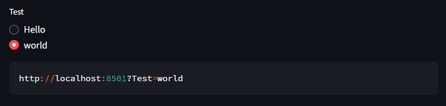

# streamlit_query_wrapper

## About
This project provides wrapper of default streamlit input widgets(checkbox, multibox, etc.).

## Install
TBA

## Usage

```python
import streamlit_query_wrapper as stq

stq.radio("Test", ["Hello", "world"])

stq.sharable_link()
```

Result


Now you can access your page with given link. If you access your page with given URL, all settings you made will be loaded.

## Components
Works with basic streamlit input components.

Supports
* `checkbox`
* `radio`
* `selectbox`
* `multiselect`
* `slider`
* `text_input`
* `number_input`

Also works with `st.sidebar`. You can use as `stq.sidebar.checkbox` and so on.

